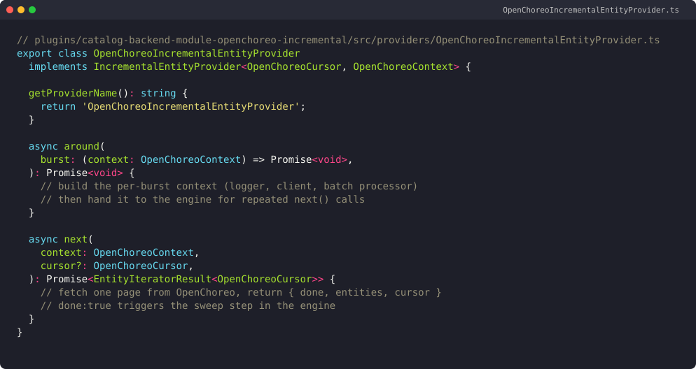
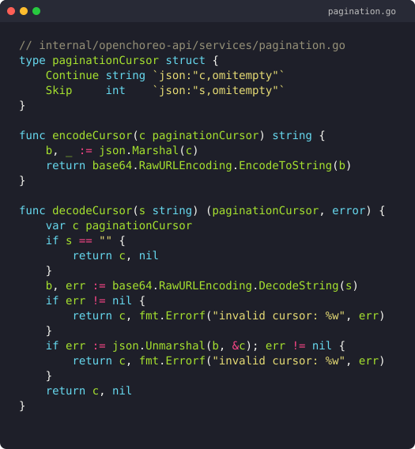
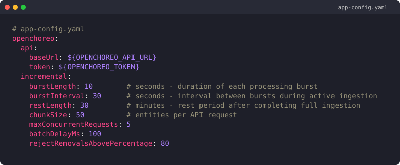

# Building an incremental entity provider for Backstage catalog ingestion

*Photo by S A on Unsplash.*

Internal developer platforms went from a niche idea to default infrastructure fast. The [DORA 2025 report](https://cloud.google.com/blog/products/ai-machine-learning/announcing-the-2025-dora-report) found that 90% of organizations now run at least one IDP, and a [CNCF and SlashData Q1 2026 study](https://www.cncf.io/announcements/2026/03/24/cncf-and-slashdata-report-finds-platform-engineering-tools-maturing-as-organizations-prepare-for-ai-driven-infrastructure/) reports 28% have a dedicated platform engineering team. The catalog is the front door. The trouble is, the default Backstage ingestion pattern does not survive a large catalog gracefully.

I hit this directly during my WSO2 internship on the OpenChoreo and Backstage developer-experience team. The original `OpenChoreoEntityProvider` polled the full dataset on every refresh tick. Memory bursts, slow cold starts, and silent orphan entities followed. Two PRs came out of the work: an incremental entity provider on the Backstage side ([PR #140](https://github.com/openchoreo/backstage-plugins/pull/140)) and a cursor-paginated list API on the OpenChoreo backend ([PR #1257](https://github.com/openchoreo/openchoreo/pull/1257)). This post covers the architecture, the code, the pagination follow-on, and what I would redo.

Both PRs are open and under active review at the time of writing. Where I refer to a specific class, function, or file, I link to the PR rather than to a line range. Open-PR line numbers drift between revisions; the "Files changed" tab on each PR is always current.

> **Key takeaways**
> - Full-dataset polling stops working once your catalog grows. With 90% of organizations now running an IDP ([DORA 2025](https://cloud.google.com/blog/products/ai-machine-learning/announcing-the-2025-dora-report)), most teams will hit the same wall.
> - I vendored Backstage's incremental-ingestion pattern, then added per-burst marks and a final sweep step to delete orphans deterministically.
> - The producer side needed cursor pagination too. I followed Kubernetes API conventions: opaque `continue` token, snapshot marker, `410 Gone` on expiry.
> - End users get `--limit` and `--all`. They never see a cursor.

## Why does full-dataset polling break the catalog?

The catalog's growth problem is real. [CNCF's 2025 Annual Survey](https://www.cncf.io/announcements/2026/01/20/kubernetes-established-as-the-de-facto-operating-system-for-ai-as-production-use-hits-82-in-2025-cncf-annual-cloud-native-survey/) put Kubernetes production use at 82% in 2025, and most of what we surface in Backstage is now Kubernetes-shaped. Sources grow, refresh ticks stay fixed, and the cost curve catches up.

The original `OpenChoreoEntityProvider` ran a familiar pattern. On every refresh, it called the upstream OpenChoreo API, built the full entity set in memory, and emitted a `full` mutation against the catalog. That worked at small scale. At larger scale, three things showed up.

The first symptom was memory. Each refresh pulled the entire dataset into a single in-process slice before handing it to Backstage. The catalog backend's resident set jumped predictably on every tick.

The second was cold-start latency. A fresh deployment had to wait one full refresh interval before the first entities appeared, and then another tick before stale rows were reconciled.

The third symptom was the bug that actually made me rewrite the thing. In a September 2025 deployment, I noticed entities deleted upstream were still showing in the catalog UI hours later. The `full` mutation had partial-failure recovery semantics: if one fetch hiccupped, the previous "complete" set was kept around and deletes were not propagated. Memory and latency are observable. Orphans are silent, and they erode trust in the catalog faster than any other failure mode.

> **Citation capsule.** Full-dataset polling breaks at scale because Kubernetes-shaped sources are now the norm, with 82% of organizations running Kubernetes in production according to the [CNCF 2025 Annual Survey](https://www.cncf.io/announcements/2026/01/20/kubernetes-established-as-the-de-facto-operating-system-for-ai-as-production-use-hits-82-in-2025-cncf-annual-cloud-native-survey/). Catalog growth then exposes the cost of full mutations on every refresh tick.

## Why did the default Backstage pattern break at our scale?

Backstage itself is a popular and well-supported project. The [backstage/backstage repository](https://github.com/backstage/backstage) carries more than 30,000 GitHub stars as of January 2026, and [CNCF lists Backstage as Incubating since 15 March 2022](https://www.cncf.io/projects/backstage/). The default `EntityProvider.applyMutation({ type: 'full', entities })` is fine for small, slow-moving sources. It was not fine for ours.

Three reasons it broke for OpenChoreo:

- Cost of "full". One mutation diffs the entire previous set against the new set. Cost grows linearly with catalog size, every tick, forever.
- No partial progress. If the producer fetch fails halfway, the next tick starts over. There is no checkpoint, no resumption.
- Delete semantics depend on the producer returning an authoritative complete list. Any upstream pagination, retry, or transient error breaks delete detection. That is exactly how we got orphans.

There was a second-order problem too. The OpenChoreo list API at the time had no pagination. Any client that wanted a complete list paid the full cost on every refresh, no matter how the consumer was written. The fix had to be two-sided. Make the consumer incremental. Then make the producer navigable so incremental actually pays off.

*Photo by Ryan Delfin from Pexels.*

## How does the incremental entity provider work?

The mark-and-sweep design is not mine. It is the upstream Backstage incremental-ingestion module pattern, [documented in the provider-cycle section of Backstage's external-integrations docs](https://backstage.io/docs/features/software-catalog/external-integrations/#provider-cycle). I vendored it as a deliberate local fork into a new plugin package, `catalog-backend-module-openchoreo-incremental`, so credit lands where it belongs.

The mark-and-sweep model has a generation identity at its center. Each ingestion run gets a generation id, the `ingestion`. As bursts complete, every entity seen this generation is recorded as a mark against that ingestion id, in the `ingestion_marks` and `ingestion_mark_entities` tables. When the producer signals "done" (no more pages), the engine sweeps. Any entity in the previous generation that has no mark in the new generation gets deleted.

That isolates two things the old full-dataset path conflated: "what we saw this run" and "what is in the catalog right now". They are different sets, and treating them as one is what produced orphans.

One thing I want to flag explicitly. People reach for the Kubernetes garbage-collector analogy here, and it is the wrong mental model. There are no `ownerReferences`, no finalizers, no foreground or background propagation. The lifecycle is per-ingestion-generation, not per-owner-graph. If you carry the K8s GC mental model into the next section, you will look for pieces that do not exist and miss the ones that do.

Three custom tables ship with the plugin's initial migration:

- `ingestions`, the generation record.
- `ingestion_marks`, the per-burst mark batch.
- `ingestion_mark_entities`, the actual marked entity refs.

I vendored instead of consuming the upstream module directly because, at the time, it did not expose the hooks I needed for OpenChoreo-shaped errors and burst sizing. A local fork let me iterate without an upstream RFC.

## How does the implementation hang together?

The work landed in [PR #140](https://github.com/openchoreo/backstage-plugins/pull/140) on `openchoreo/backstage-plugins`. The PR is shipped to PR, under review, not merged. The shape on the provider side is small. The engine drives a `next(context, cursor)` call repeatedly inside an `around` envelope, and the provider returns a page plus a continuation cursor.

The full implementation lives in `OpenChoreoIncrementalEntityProvider` inside the new plugin `catalog-backend-module-openchoreo-incremental`. The diff is in [PR #140's Files changed tab](https://github.com/openchoreo/backstage-plugins/pull/140/files).

The way I learned this engine was by adding a log line at every lifeline and watching one ingestion play out. The sequence is straightforward once you see it land in order. The engine ticks on a scheduler. It calls `next(cursor)`. The provider hits the upstream API, returns a page and a fresh cursor, and the engine writes mark rows for that page. The loop repeats until the provider returns `done: true`, at which point the engine runs `computeRemoved` and deletes orphans.

`OpenChoreoIncrementalIngestionEngine` is where the burst loop and sweep handoff live. The actual orphan computation happens in `OpenChoreoIncrementalIngestionDatabaseManager.computeRemoved`, which compares the prior generation's marks to the current generation's marks and emits deletes. `componentBatchProcessor` is the per-burst batch boundary, and I will come back to it in the throttling discussion.

> **Citation capsule.** OpenChoreo's incremental provider follows the [Backstage incremental-ingestion provider cycle](https://backstage.io/docs/features/software-catalog/external-integrations/#provider-cycle): an `around` envelope, repeated `next(cursor)` calls, and a final sweep when the provider signals `done: true`. Generation-scoped marks let the engine compute deletes deterministically without trusting a single complete list.

## What pagination problem did we find next?

Incremental ingestion only pays off if the producer can be navigated page by page. With no upstream pagination, every burst was still pulling the full list and chunking client-side. That preserved the very memory burst we were trying to remove. The consumer-side win was capped by the producer.

Concretely, the first burst of a fresh ingestion was as expensive as the old full-dataset poll, because the upstream `GET` returned everything at once. Later bursts were cheap because they had nothing left to fetch. We had moved the cost, not removed it.

So the proposal moved server-side. The proposal lives in [GitHub Discussion #837](https://github.com/openchoreo/openchoreo/discussions/837). There is no `GITHUB_PROPOSAL.md` in the repository; the discussion is the proposal of record, and that is where the design got argued through.

I had to honor a few constraints:

- Do not break existing `choreoctl` users.
- Be safe to expire mid-pagination, so a long-running list does not pin server state forever.
- Compose cleanly with the Backstage incremental provider's `cursor` field.

The right reference model here is the Kubernetes list-pagination protocol. Not "build something new". This is also the place where the Kubernetes analogy is correct, after I spent the previous section saying it was wrong for the ingestion lifecycle. List protocols and lifecycle protocols are different problems.

*Photo by Daniel Forsman on Unsplash.*

## How does cursor pagination work for OpenChoreo?

I followed the [Kubernetes API conventions for retrieving large result sets in chunks](https://kubernetes.io/docs/reference/using-api/api-concepts/#retrieving-large-results-sets-in-chunks): an opaque `continue` token, a `ResourceVersion`-style snapshot marker so the server can detect drift, and `410 Gone` when the token has expired past the retention window. The shape of OpenChoreo's `continue` token mirrors that protocol almost directly.

The token itself is base64-url-encoded JSON with two fields. Encoding and decoding live in `pagination.go`.

Two fields, two roles. The `c` value is the upstream Kubernetes `continue` token, which the OpenChoreo API forwards to controller-runtime through `client.Continue(...)`. The `s` value is a within-page skip pointer. We need it because authorization checks and project filters can reject some items inside a page, which means a single Kubernetes page does not always map cleanly to a single response page. The skip pointer lets the server resume mid-page after filtering.

Server expiry is where the protocol earns its keep. When the upstream Kubernetes `continue` token has aged out, apimachinery returns a typed error. `HandleListError` checks `apierrors.IsResourceExpired(err)` and produces a typed `ErrContinueTokenExpired` sentinel. The HTTP layer then maps that sentinel to `410 Gone` in `handlePaginationError`. Malformed tokens produce `400 Bad Request` through the same handler. This mirrors Kubernetes' own `410 Gone` semantics on expired `continue` tokens, which is exactly what most Kubernetes clients already know how to retry against.

Defaults come from a small constants package: `DefaultPageLimit=100`, `MaxPageLimit=512`. The Backstage provider asks for 50 per page in normal operation, well under the cap. [PR #1257](https://github.com/openchoreo/openchoreo/pull/1257) is shipped to PR, under review, not merged.

> **Citation capsule.** OpenChoreo's pagination contract follows [Kubernetes API conventions for list pagination](https://kubernetes.io/docs/reference/using-api/api-concepts/#retrieving-large-results-sets-in-chunks): opaque `continue` token, `ResourceVersion`-style snapshot marker, and `410 Gone` when the token has expired. Server defaults are 100 per page, capped at 512.

## How do choreoctl and the Backstage clients consume it?

`choreoctl` does not expose a `--continue` flag. End users see two flags: `--limit`, which caps a single page, and `--all`, which pulls every page. Auto-pagination is internal, hidden behind `fetchAllPages` in the API client. I made that choice on purpose. Cursor lifetime, expiry, and retry are protocol details. End users should never have to think about them.

Flag definitions live in the CLI's shared `flags` package, and individual `get <resource>` commands compose them through a small command builder. `--all` triggers `fetchAllPages` in the client. `fetchAllPages` loops on the `continue` token until empty, surfacing a single combined slice to the caller. The full diff is in [PR #1257's Files changed tab](https://github.com/openchoreo/openchoreo/pull/1257/files).

The Backstage client side is similar in spirit. It uses `openapi-fetch` against the OpenChoreo API. There is no rate-limited HTTP client. Throttling is application-level, in two places:

- Per-burst batch concurrency in the component batch processor. Constants are `MAX_CONCURRENT=5` and `BATCH_DELAY=100ms`.
- Engine-level backoff schedule of `[1m, 5m, 30m, 3h]` declared in the provider module's burst configuration.

The two layers do different jobs. Per-burst batch concurrency keeps a single ingestion sane against the upstream API. Engine backoff handles upstream outages without hammering, by stretching the rest interval after repeated failures.

The README ships a working YAML config block end users can copy.

`rejectRemovalsAbovePercentage` is worth calling out. It is a safety valve. If a single sweep would delete more than 80% of the catalog (because, say, the upstream API silently returned an empty list), the engine refuses the sweep and surfaces a warning instead of nuking the catalog.

## What did I get wrong on the first try?

The honest answer is: the orphan bug. I did not catch it until that September 2025 deployment. The internal monthly progress report from Sep 2025 records the day I noticed deleted components still appearing in the UI hours after upstream removal. The spec said "deletes propagate". I assumed that meant "the next refresh picks them up". It did not. The old provider's `full` mutation had partial-failure recovery that masked deletes when any fetch in the batch had hiccupped, and I had not written a failing test for the delete path. The lesson I keep coming back to is small and unglamorous: write the failing test before you trust the spec.

A few other items came out of review:

- First sweep implementation only ran one pass. Reviewer feedback flagged that orphan rows could survive in `refresh_state` if the catalog processor had partially observed them between marks. Second pass added.
- Reviewer feedback on the cursor handling: I was mutating the cursor object directly across burst boundaries. That is fragile if the engine ever retries a burst. I switched to immutable cursor returns.
- Error detection started out as `if err.Error() == "http 429"` string-matching. Replaced with a typed sentinel error.
- An unused `fetchAllComponents` method survived the cursor migration. Dead-code review feedback caught it. Deleted.

If I started over today, I would do three things differently. I would write the orphan test first, against a fixture that simulates a half-completed upstream list. I would design the cursor token before the consumer, because the consumer's retry logic is downstream of the token's expiry semantics. And I would not vendor the upstream incremental-ingestion module unless the upstream RFC path is actually blocked. Vendoring is fine, but it carries a maintenance tax I underestimated.

## FAQ

### Why not just use Backstage's built-in incremental-ingestion module?
I did, by vendoring it. At the time, the upstream module did not expose the hooks I needed for OpenChoreo-shaped errors and burst sizing, and a local fork let me iterate without an upstream RFC. The pattern itself comes straight from the [Backstage incremental-ingestion docs](https://backstage.io/docs/features/software-catalog/external-integrations/#provider-cycle).

### How is the continue token validated server-side?
Base64-url decode produces `{c, s}` JSON. The `c` value is forwarded to controller-runtime, which compares it against the current `ResourceVersion` window. On mismatch, apimachinery returns `IsResourceExpired`, which `HandleListError` maps to a typed `ErrContinueTokenExpired` sentinel, which the HTTP handler returns as `410 Gone`.

### What happens if a token expires mid-sweep?
The engine receives `410 Gone`, treats the ingestion generation as terminated, and restarts from cursor zero with a fresh generation id. Marks already written under the old generation are discarded by the next sweep, because the new generation id wins. This mirrors [Kubernetes' own retry semantics on expired continue tokens](https://kubernetes.io/docs/reference/using-api/api-concepts/#retrieving-large-results-sets-in-chunks).

### Does the sweep handle re-parented entities?
Yes. Identity is by entity ref, not by parent path. If the same ref appears in the new generation with a different parent, it is a mark hit, not a delete. `computeRemoved` in `OpenChoreoIncrementalIngestionDatabaseManager` operates on entity refs, so re-parenting is invisible to the sweep.

### How does this interact with Backstage's `refresh_state`?
The sweep deletes rows from `refresh_state` in the same transaction as the mark cleanup, so there is no window where the catalog UI shows an entity the provider has already disowned. The transaction boundary is enforced inside `computeRemoved` on the database manager.

## References

1. PR #140, openchoreo/backstage-plugins, https://github.com/openchoreo/backstage-plugins/pull/140 (incremental entity provider, shipped to PR, under review).
2. PR #1257, openchoreo/openchoreo, https://github.com/openchoreo/openchoreo/pull/1257 (cursor pagination on the list API, shipped to PR, under review).
3. GitHub Discussion #837, openchoreo/openchoreo, https://github.com/openchoreo/openchoreo/discussions/837 (cursor pagination proposal of record).
4. Backstage incremental-ingestion provider cycle, https://backstage.io/docs/features/software-catalog/external-integrations/#provider-cycle.
5. Kubernetes API conventions, retrieving large result sets in chunks, https://kubernetes.io/docs/reference/using-api/api-concepts/#retrieving-large-results-sets-in-chunks.
6. DORA 2025 report, https://cloud.google.com/blog/products/ai-machine-learning/announcing-the-2025-dora-report (90% IDP adoption).
7. CNCF 2025 Annual Survey, https://www.cncf.io/announcements/2026/01/20/kubernetes-established-as-the-de-facto-operating-system-for-ai-as-production-use-hits-82-in-2025-cncf-annual-cloud-native-survey/ (Kubernetes production use 82%).
8. CNCF Backstage project page, https://www.cncf.io/projects/backstage/ (Incubating since 15 March 2022).
9. CNCF and SlashData Q1 2026 platform engineering report, https://www.cncf.io/announcements/2026/03/24/cncf-and-slashdata-report-finds-platform-engineering-tools-maturing-as-organizations-prepare-for-ai-driven-infrastructure/ (28% have a dedicated platform engineering team).
10. backstage/backstage GitHub repository, https://github.com/backstage/backstage (30,000+ stars as of January 2026).

